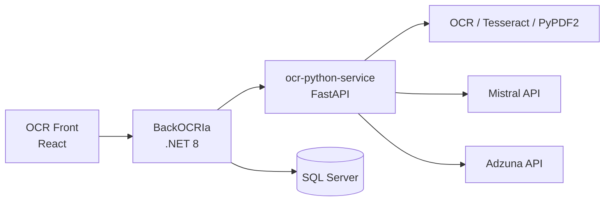

# OCR con IA — Procesamiento de CVs y matching de ofertas

Aplicación full stack que automatiza el procesamiento de documentos (CVs, facturas, contratos) con OCR e IA, extrae datos estructurados del candidato y recomienda ofertas de empleo con porcentaje de afinidad, skills faltantes y pitch personalizado.

Ideal para demostrar arquitectura de microservicios, integración Python + .NET, APIs de IA (Mistral) y un frontend moderno en React.

## Problema que resuelve

Procesar CVs y documentos a mano es lento y propenso a errores. Los reclutadores y candidatos necesitan:

- Extraer texto de PDFs e imágenes de forma fiable.
- Obtener un resumen y clasificación automática.
- Estructurar nombre, contacto, experiencia, educación y habilidades.
- Comparar el perfil con ofertas reales y ver qué encaja y qué falta.

Este proyecto automatiza ese flujo de punta a punta.

## Funcionalidades

| Área | Qué hace |
|------|----------|
| **OCR** | Extrae texto de PDFs (PyPDF2) e imágenes (Tesseract). |
| **IA (Mistral)** | Resumen, clasificación del documento y extracción estructurada del CV. |
| **Candidatos** | Guardar perfiles en base de datos (.NET + SQL Server). |
| **Ofertas** | Búsqueda en Adzuna + matching CV ↔ oferta (% afinidad, skills faltantes, pitch). |
| **UI** | Subida de archivos, listado de candidatos, página de ofertas recomendadas. |

## Arquitectura



- **OCR Front** — Interfaz de usuario (React, TypeScript, Tailwind, Framer Motion).
- **ocr-python-service** — OCR, IA y búsqueda de empleo (FastAPI).
- **BackOCRIa** — API REST, persistencia y orquestación (.NET 8).

## Stack tecnológico

| Capa | Tecnologías |
|------|-------------|
| **Frontend** | React 18, TypeScript, Vite, Tailwind CSS, Framer Motion, React Router |
| **Servicio IA / OCR** | Python 3.10+, FastAPI, Tesseract, PyPDF2, Mistral API, Adzuna API |
| **API / datos** | .NET 8, ASP.NET Core, Entity Framework Core, SQL Server |
| **Patrones** | Microservicios, REST, separación de responsabilidades, DTOs |

## Estructura del repositorio

```
OCR ia/
├── OCR Front/              # Frontend React (puerto 5173)
├── ocr-python-service/     # Microservicio Python (puerto 8000)
│   ├── app.py
│   ├── services/
│   │   ├── ocr_service.py
│   │   ├── ai_service.py
│   │   └── jobs_service.py
│   └── requirements.txt
└── BackOCRIa/
    └── BackOCRIa/          # API .NET (puerto 5052 / 7223)
        ├── Controllers/
        ├── Service/
        ├── Models/
        └── Data/
```

## Requisitos previos

- Python 3.10+
- Node.js 18+
- .NET 8 SDK
- SQL Server (LocalDB, SQL Express o instancia local) para candidatos y ofertas guardadas
- Tesseract OCR instalado (Windows: añadir al PATH o configurar ruta en `ocr_service.py`)
- API Key de Mistral (obligatoria)
- Claves de Adzuna (opcional; sin ellas la búsqueda de ofertas devuelve lista vacía)

## Configuración

### 1. Servicio Python (`ocr-python-service`)

```bash
cd ocr-python-service
python -m venv venv

# Windows
venv\Scripts\activate

# Linux / macOS
# source venv/bin/activate

pip install -r requirements.txt
```

Copia `.env.example` a `.env` y completa:

```env
MISTRAL_API_KEY=tu_clave_mistral
ADZUNA_APP_ID=tu_app_id
ADZUNA_APP_KEY=tu_app_key
```

### 2. API .NET (`BackOCRIa`)

Ajusta la cadena de conexión en `BackOCRIa/BackOCRIa/appsettings.Development.json`:

```json
"ConnectionStrings": {
  "DefaultConnection": "Server=TU_SERVIDOR;Database=OcrIaDb;Trusted_Connection=True;TrustServerCertificate=True;"
},
"PythonService": {
  "BaseUrl": "http://localhost:8000"
}
```

Aplica migraciones (desde la carpeta del proyecto .NET):

```bash
cd BackOCRIa/BackOCRIa
dotnet ef database update
```

(Si no tienes la herramienta EF: `dotnet tool install --global dotnet-ef`)

### 3. Frontend (`OCR Front`)

```bash
cd "OCR Front"
npm install
```

## Cómo ejecutar (flujo completo)

Abre tres terminales:

**Terminal 1 — Python**

```bash
cd ocr-python-service
venv\Scripts\activate
uvicorn app:app --reload --host 0.0.0.0 --port 8000
```

**Terminal 2 — .NET**

```bash
cd BackOCRIa/BackOCRIa
dotnet run
```

**Terminal 3 — Frontend**

```bash
cd "OCR Front"
npm run dev
```

Abre http://localhost:5173:

1. Sube un CV (PDF o imagen) y pulsa **Procesar documento**.
2. Revisa texto, resumen, clasificación y datos estructurados.
3. Pulsa **Guardar candidato**.
4. En **Candidatos guardados**, entra en **Ver oportunidades**.
5. Pulsa **Buscar ofertas para mi perfil** para obtener recomendaciones con % de match.

> **Solo desarrollo rápido (sin .NET):** puedes usar solo Python + frontend; el procesamiento OCR/IA funciona contra `http://localhost:8000`. Guardar candidatos y ofertas requiere la API .NET.

## Endpoints principales

### Python (`http://localhost:8000`)

| Método | Ruta | Descripción |
|--------|------|-------------|
| `POST` | `/process` | Sube PDF/imagen → OCR + resumen + clasificación + datos estructurados del CV |
| `POST` | `/jobs/search` | Body: `summary`, `skills`, `current_role` → ofertas Adzuna + match IA |
| `GET` | `/health` | Estado del servicio |

### .NET (`http://localhost:5052` o `https://localhost:7223`)

| Método | Ruta | Descripción |
|--------|------|-------------|
| `POST` | `/api/candidates` | Guardar candidato |
| `GET` | `/api/candidates` | Listar candidatos |
| `GET` | `/api/candidates/{id}` | Obtener candidato |
| `DELETE` | `/api/candidates/{id}` | Eliminar candidato |
| `GET` | `/api/candidates/{id}/recommendations` | Ofertas guardadas |
| `POST` | `/api/candidates/{id}/recommendations` | Buscar ofertas (Python) y guardar |

## Qué demuestra este proyecto (para reclutadores)

- Desarrollo full stack (React + Python + C#).
- Arquitectura de microservicios y comunicación HTTP entre servicios.
- Integración con APIs de IA (Mistral) y APIs de terceros (Adzuna).
- OCR en producción (Tesseract, PDFs).
- Persistencia con EF Core y SQL Server.
- UX moderna (Tailwind, animaciones, flujo candidato → ofertas).

## Licencia

MIT
